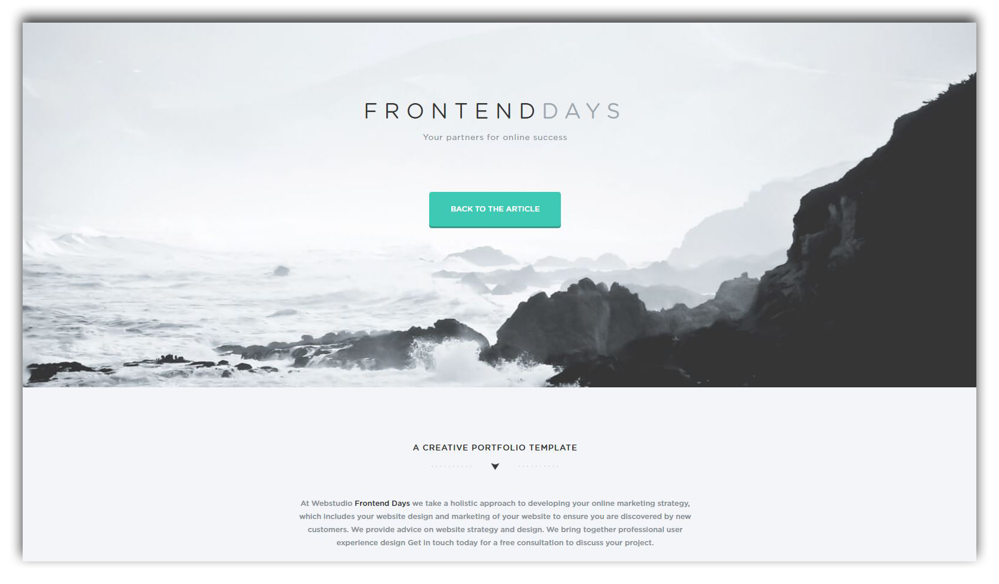
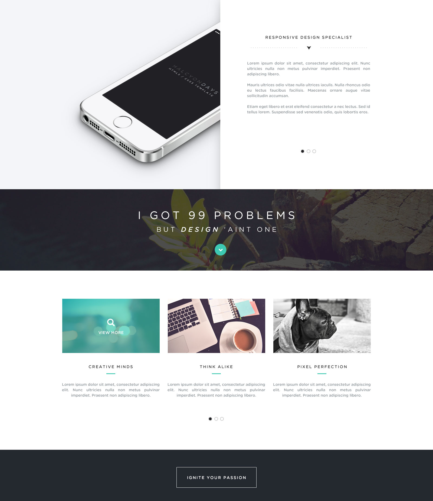

# Frontend Days

Frontend Days is a modern and stylish HTML5/CSS3 one page website (based on free psd website template). Frontend Days is a multi-purpose website that you can use it for a web app, digital agency or business website. Check out the demo of the website here: [Frontend Days](https://maksymchak.github.io/frontend-days/) 

# Built on:

* Flexbox
* Smooth Scroll
* normalize.css
* FlexSlider
* Font Awesome Icons

# Features:

* HTML5 and CSS3
* Made with the latest web technologies
* Attractive and modern design

## Misc

Follow Me: [LinkedIn](https://www.linkedin.com/in/anton-maksymchak/), [Facebook](https://www.facebook.com/Anton.Maksymchak), [GitHub](https://github.com/maksymchak)

©[Anton Maksymchak](https://github.com/maksymchak) 2018
